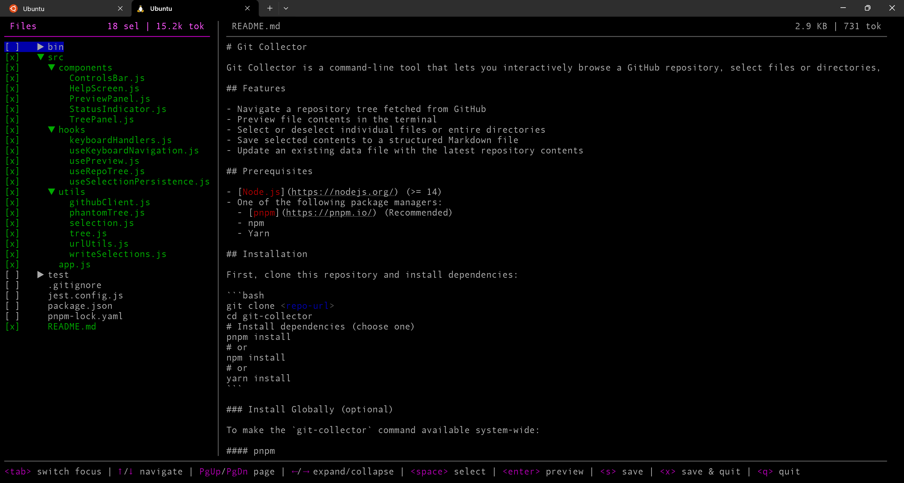

# Git Collector

Git Collector is a command-line tool that lets you interactively browse a GitHub repository, select files or directories, and collect their contents into a Markdown data file. It's useful for gathering code snippets, configuration files, or other resources from a repository for offline use or documentation, especially for sharing with an AI assistant.



## Features

- Navigate a repository tree fetched from GitHub
- Preview file contents in the terminal
- Select or deselect individual files or entire directories
- Save selected contents to a structured Markdown file
- Update an existing data file with the latest repository contents

## Prerequisites

- [Node.js](https://nodejs.org/) (>= 14)
- One of the following package managers:
  - [pnpm](https://pnpm.io/) (Recommended)
  - npm
  - Yarn

## Installation

### From npm registry

Install the published package globally with pnpm:

```bash
pnpm add -g git-collector
# or with npm:
npm install --global git-collector
# or with Yarn:
yarn global add git-collector
```

After installation, you can invoke:

```bash
git-collector <dest.md>
```

### From source

First, clone this repository and install dependencies:

```bash
git clone <repo-url>
cd git-collector
# Install dependencies (choose one)
pnpm install
# or
npm install
# or
yarn install
```

### Install Globally (optional)

To make the `git-collector` command available system-wide:

#### pnpm

```bash
pnpm link --global
```

#### npm

```bash
npm link
```

#### Yarn

```bash
yarn link
```

Once linked, you can run the command globally:

```bash
git-collector <dest.md>
```

## Usage

```bash
git-collector [--update] <dest.md>
```

- `<dest.md>`: Path to the Markdown data file to create or update.
- `--update`: If the file exists, fetch the latest contents for previously selected files and update the data file.

### Create a New Data File

```bash
git-collector data.md
```

- You'll be prompted to enter a GitHub repository URL (e.g., `https://github.com/user/repo`).
- Use the following keys to interact:
  - `<↑>/<↓>`: Navigate the file tree
  - `<←>/<→>`: Expand or collapse directories
  - `<PgUp>/<PgDn>`: Page-scroll
  - `<space>`: Select or deselect a file or directory
  - `<enter>`: Preview the selected file
  - `<tab>`: Switch focus between tree and preview
  - `<s>`: Save selections to the data file
  - `<x>`: Save and exit
  - `<q>`: Quit without saving
  - `<w>`: Toggle word-wrap in preview (when focused on preview)

### Update an Existing Data File

```bash
git-collector --update data.md
```

- Reloads the URL and file list from `data.md` and fetches current contents, reporting how many files were updated or removed, without invoking the interactive UI.
- This is useful for integrating with other tools or scripts, or just as a quick way to refresh the data file.

### Run Without Global Install

You can run the CLI directly or via your package manager without linking globally:

```bash
# Directly with Node.js
node bin/cli.js data.md

# pnpm
pnpm exec git-collector data.md

# npm
npm start -- data.md

# Yarn
yarn start -- data.md
```

## Development & Testing

- Run tests:
  ```bash
  pnpm test
  # or
  npm test
  # or
  yarn test
  ```
